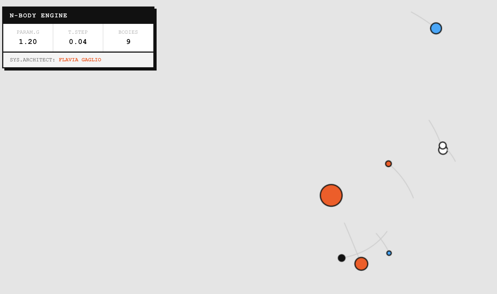

# Keplerian Module // N-Body Gravitational Synthesizer



> **[ ACCESS THE LIVE ENGINE ](https://flaviagaglio.github.io/kepler0)**

## Overview
**Keplerian Module** è un'architettura di simulazione astrofisica bidimensionale sviluppata per il calcolo in tempo reale del problema degli $N$-corpi (N-Body problem). A differenza dei modelli cinematici basati su orbite pre-calcolate, questo motore risolve dinamicamente le interazioni gravitazionali tra entità celesti, elaborando la propagazione spaziale frame per frame attraverso l'integrazione numerica delle forze.

Il progetto unisce la computazione fisica rigorosa a un'interfaccia utente (HUD) di ispirazione hardware industriale. Adottando i paradigmi visivi del design brutalista e degli strumenti di sintesi elettronica (es. Teenage Engineering), il sistema offre un ambiente di telemetria privo di distrazioni, focalizzato sull'osservazione dei fenomeni di caos deterministico, collasso gravitazionale e fionda orbitale.

## Mathematical Foundation
Il core del motore fisico si basa sui principi della meccanica classica hamiltoniana, adattati per l'elaborazione iterativa in un ambiente computazionale 2D. 

### 1. Legge di Gravitazione Universale
In un sistema a $N$ masse puntiformi, la forza gravitazionale esercitata su un corpo $i$-esimo da un corpo $j$-esimo è definita da:

$$F_{ij} = G \frac{m_i m_j}{r_{ij}^2}$$

Dove $G$ è la costante gravitazionale arbitraria del sistema, $m$ rappresenta le masse e $r$ la distanza euclidea.

### 2. Decomposizione Vettoriale e Smorzamento (Softening)
Per calcolare le componenti vettoriali dell'accelerazione ed evitare la singolarità matematica in caso di collisione esatta (che porterebbe l'accelerazione asintoticamente a infinito), l'equazione della distanza viene stabilizzata con l'introduzione di un parametro di *softening* (smorzamento) $\epsilon$:

$$r = \sqrt{\Delta x^2 + \Delta y^2 + \epsilon}$$

La scomposizione vettoriale dell'accelerazione $a$ per il corpo $i$ (sapendo che $a = F/m$) risulta quindi:

$$a_x = \sum_{j \neq i} G \frac{m_j \Delta x}{r^3}$$
$$a_y = \sum_{j \neq i} G \frac{m_j \Delta y}{r^3}$$

### 3. Integrazione Numerica
L'evoluzione temporale del sistema è calcolata tramite il metodo di integrazione di Eulero semi-implicito, che garantisce una maggiore conservazione dell'energia rispetto all'Eulero esplicito tradizionale. Ad ogni passo temporale $\Delta t$, il differenziale aggiorna i vettori cinematici:

$$v_{t+1} = v_t + a \cdot \Delta t$$
$$p_{t+1} = p_t + v_{t+1} \cdot \Delta t$$

## Technical Architecture & Features
L'intero ecosistema è progettato con un approccio *bare-metal*: non fa uso di framework esterni, motori fisici di terze parti o librerie grafiche ad alto livello, garantendo prestazioni ottimali e controllo assoluto sull'allocazione della memoria nel ciclo di rendering.

*   **Algoritmo O(n²):** Calcolo esaustivo delle interazioni per ogni coppia di masse, ottimizzato per garantire i 60 FPS costanti nei cluster planetari di media densità.
*   **Stochastic Mass Injection:** L'utente può perturbare attivamente il sistema generando nuovi corpi celesti (tramite puntatore o tocco). Il sistema assegna vettori di velocità iniziale e magnitudo di massa stocastici per studiare la stabilizzazione o il decadimento delle nuove orbite.
*   **Bufferizzazone delle Tracce (Orbital Tracing):** Rendering ad alta efficienza delle scie spaziali mediante array circolari (FIFO) per visualizzare la precessione del periapside e l'evoluzione delle eccentricità orbitali.
*   **Mobile-First Scaling:** Adattamento dinamico del sistema di coordinate scalari in base al viewport e prevenzione degli eventi nativi di scrolling (`overscroll-behavior: none`, `preventDefault`) per garantire una manipolazione tattile a latenza zero sui dispositivi mobili.

## Deployment & Local Installation
Il progetto è un'applicazione web statica ed è attualmente in esecuzione tramite GitHub Pages.

Per testare e compilare il modulo localmente:
1. Clona il repository:
   ```bash
   git clone [https://github.com/TuoUsername/kepler0.git](https://github.com/flaviagaglio/kepler0.git)
2. Naviga nella directory del progetto:
    ```bash
    cd kepler0
3. Naviga nella directory del progetto:
    Avvia il sistema aprendo index.html in un browser web compatibile con gli standard HTML5 Canvas. Non è richiesto alcun processo di build o runtime server.

## System Architect
Progettato e sviluppato da [Flavia Gaglio](https://flaviagaglio.github.io/).